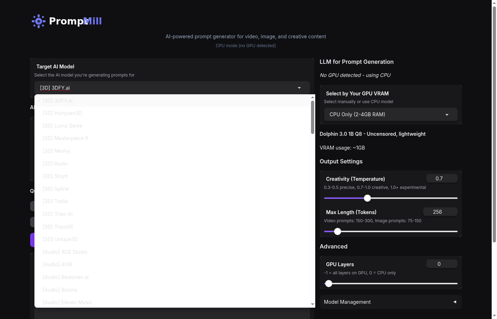

<div align="center">


<br/>

**AI-powered prompt generator for video, image, and creative content**

[](https://python.org)
[](https://gradio.app)
[](https://docker.com)
[](https://docs.astral.sh/ruff/)
[](LICENSE)
[](https://github.com/kekzl/PromptMill)

[Features](#-features) · [Quick Start](#-quick-start) · [Supported Targets](#-supported-targets) · [Models](#-llm-options) · [Configuration](#%EF%B8%8F-configuration)

</div>

---

## Overview

PromptMill is a self-contained web UI that runs **entirely locally** - no API keys, no cloud dependencies. It uses selectable LLMs (scaled by your GPU VRAM) to generate optimized prompts for the latest AI video and image generators.

<div align="center">
<table>
<tr>
<td align="center"><b>102</b><br><sub>Preset Roles</sub></td>
<td align="center"><b>7</b><br><sub>LLM Options</sub></td>
<td align="center"><b>1B-8B</b><br><sub>Parameters</sub></td>
<td align="center"><b>100%</b><br><sub>Local</sub></td>
</tr>
</table>
</div>

---

## 📸 Screenshots

<div align="center">

### Main Interface


*Clean dark UI with quick examples and customizable generation settings*

### 102 AI Model Targets


*Support for Video, Image, Audio, 3D, and Creative AI tools*

</div>

---

## ✨ Features

- **Smart GPU Detection** - Automatically selects the best model for your VRAM
- **7 LLM Tiers** - From 1B (CPU) to 8B parameters (24GB+ VRAM) using Dolphin models
- **102 Specialized Roles** - Video (22), Image (21), Audio (13), 3D (12), and Creative (34)
- **Dark Mode UI** - Modern interface with streaming generation
- **Model Cleanup** - Delete downloaded models to free disk space
- **Zero Config** - Works out of the box with Docker
- **Fully Offline** - No API keys or internet required after setup
- **Thread-Safe** - Concurrent request handling with proper locking
- **Configurable** - Environment variables for server settings

---

## 🚀 Quick Start

### Docker (Recommended)

```bash
# GPU (NVIDIA) - auto-detects VRAM
docker compose --profile gpu up -d

# CPU only
docker compose --profile cpu up -d
```

Open **http://localhost:7610**

> Models auto-download on first use and persist in `./models/`

### Manual Installation

```bash
# GPU (CUDA)
CMAKE_ARGS="-DGGML_CUDA=on" pip install llama-cpp-python
pip install gradio huggingface_hub
python -m promptmill

# CPU only
pip install llama-cpp-python gradio huggingface_hub
python -m promptmill
```

---

## 🎯 Supported Targets

<table>
<tr>
<td width="50%">

### 🎬 Video (22)
Wan2.1, Wan2.2, Wan2.5, Hunyuan Video, Hunyuan 1.5, Runway Gen-3, Kling AI, Kling 2.1, Pika Labs, Pika 2.1, Luma Dream Machine, Luma Ray2, Sora, Veo, Veo 3, Hailuo AI, Seedance, SkyReels V1, Mochi 1, CogVideoX, LTX Video, Open-Sora

### 🖼️ Image (21)
Stable Diffusion, SD 3.5, FLUX, FLUX 2, Midjourney, DALL-E 3, ComfyUI, Ideogram, Leonardo AI, Adobe Firefly, Recraft, Imagen 3, Imagen 4, GPT-4o Images, Reve Image, HiDream-I1, Qwen-Image, Recraft V3, FLUX Kontext, Ideogram 3, Grok Image

</td>
<td width="50%">

### 🔊 Audio (13)
Suno AI, Udio, ElevenLabs, Eleven Music, Mureka AI, SOUNDRAW, Beatoven.ai, Stable Audio 2.0, MusicGen, Suno v4.5, ACE Studio, AIVA, Boomy

### 🧊 3D (12)
Meshy, Tripo AI, Rodin, Spline, Sloyd, 3DFY.ai, Luma Genie, Masterpiece X, Hunyuan3D, Trellis, TripoSR, Unique3D

### ✍️ Creative (34)
Story Writer, Code Generator, Technical Writer, Marketing Copy, SEO Content, Screenplay Writer, Social Media Manager, Video Script Writer, Song Lyrics, Email Copywriter, Product Description, Podcast Script, Resume Writer, Cover Letter, Speech Writer, Game Narrative, UX Writer, Press Release, Poetry Writer, Data Analysis, Business Plan, Academic Writing, Tutorial Creator, Newsletter Writer, Legal Document, Grant Writer, API Documentation, Course Creator, Pitch Deck, Meeting Notes, Changelog Writer, Recipe Creator, Travel Guide, Workout Plan

</td>
</tr>
</table>

---

## 🧠 LLM Options

PromptMill automatically selects the best model based on your GPU. All models are **uncensored Dolphin** variants:

| VRAM | Model | Size | Quality |
|:-----|:------|:-----|:--------|
| CPU | Dolphin 3.0 Llama 3.2 1B Q8 | ~1GB | ⭐ |
| 4GB | Dolphin 3.0 Llama 3.2 3B Q4_K_M | ~2.5GB | ⭐⭐ |
| 6GB | Dolphin 3.0 Llama 3.2 3B Q8 | ~4GB | ⭐⭐⭐ |
| 8GB | Dolphin 3.0 Llama 3.1 8B Q4_K_M | ~6GB | ⭐⭐⭐⭐ |
| 12GB | Dolphin 3.0 Llama 3.1 8B Q6_K_L | ~10GB | ⭐⭐⭐⭐ |
| 16GB+ | Dolphin 3.0 Llama 3.1 8B Q8 | ~12GB | ⭐⭐⭐⭐⭐ |
| 24GB+ | Dolphin 2.9.4 Llama 3.1 8B Q8 (131K ctx) | ~10GB | ⭐⭐⭐⭐⭐ |

---

## ⚙️ Configuration

The app auto-configures based on your hardware:

- **GPU detected** → Uses all layers on GPU, selects model by VRAM
- **No GPU** → CPU mode with lightweight 1B model

Manual override available in the UI for GPU layers and model selection.

### Environment Variables

| Variable | Default | Description |
|:---------|:--------|:------------|
| `SERVER_HOST` | `127.0.0.1` | Server bind address (use `0.0.0.0` for network access) |
| `SERVER_PORT` | `7610` | Server port |
| `MODELS_DIR` | `/app/models` | Directory for model storage |

> **Security Note**: The default `127.0.0.1` only allows local access. For network/Docker access, use `SERVER_HOST=0.0.0.0` with a reverse proxy (nginx/traefik) for production.

Example:
```bash
SERVER_PORT=8080 python -m promptmill
```

---

## 📁 Project Structure

```
PromptMill/
├── src/promptmill/          # Application source (Hexagonal Architecture)
│   ├── __main__.py          # Entry point
│   ├── container.py         # Dependency injection container
│   ├── domain/              # Domain layer (entities, ports, exceptions)
│   │   ├── entities/        # Model, Role, GPUInfo
│   │   ├── value_objects/   # PromptGenerationRequest/Result
│   │   ├── ports/           # Abstract interfaces (LLM, Repository)
│   │   └── exceptions.py    # Domain exceptions
│   ├── application/         # Application layer (use cases, services)
│   │   ├── use_cases/       # GeneratePrompt, LoadModel, etc.
│   │   └── services/        # PromptService, ModelService, HealthService
│   ├── infrastructure/      # Infrastructure layer (adapters, config)
│   │   ├── adapters/        # LlamaCpp, HuggingFace, NvidiaSmi adapters
│   │   ├── config/          # Settings, ModelConfigs
│   │   └── persistence/     # RolesData (102 role templates)
│   └── presentation/        # Presentation layer (Gradio UI)
│       ├── gradio_app.py    # Main UI
│       └── theme.py         # Dark theme configuration
├── tests/                   # Unit & integration tests
├── pyproject.toml           # Project config & dependencies
├── assets/logo.svg          # Logo
├── Dockerfile.gpu           # CUDA build
├── Dockerfile.cpu           # CPU build
├── docker-compose.yml       # Docker orchestration
└── models/                  # Downloaded LLMs (persisted)
```

---

## 🛠️ Development

Requires Python 3.12+ and [uv](https://docs.astral.sh/uv/) (recommended) or pip.

```bash
# Install dependencies
uv sync

# Run application
uv run python -m promptmill

# Lint & format
uv run ruff check --fix
uv run ruff format

# Run tests
PYTHONPATH=src uv run pytest tests/unit -v
```

### Architecture

PromptMill uses **Hexagonal Architecture** (Ports and Adapters) with **Domain-Driven Design**:

- **Domain Layer**: Pure Python entities, value objects, and port interfaces
- **Application Layer**: Use cases and services orchestrating business logic
- **Infrastructure Layer**: Adapters implementing ports (LlamaCpp, HuggingFace, etc.)
- **Presentation Layer**: Gradio UI adapter

---

## 🔧 Troubleshooting

### CUDA/GPU Errors
- Set GPU Layers to `0` in the UI for CPU-only mode
- Ensure NVIDIA drivers are installed: `nvidia-smi`
- For Docker: use `--profile gpu` and ensure nvidia-container-toolkit is installed

### Model Download Issues
- Check internet connectivity
- Models are cached in `./models/` directory
- Delete and re-download: use "Model Management" in UI

### Memory Issues
- Try a smaller model (lower VRAM tier)
- Close other GPU-intensive applications
- Model auto-unloads after 10 seconds of inactivity

### Port Already in Use
```bash
SERVER_PORT=8080 python -m promptmill
```

---

## 🤝 Contributing

Contributions welcome! Feel free to:
- Report bugs or request features via [Issues](https://github.com/kekzl/PromptMill/issues)
- Submit pull requests

---

## 📄 License

MIT License - see [LICENSE](LICENSE) for details.

---

<div align="center">

**[⬆ Back to top](#)**

Made with ❤️ for the AI creative community

</div>
