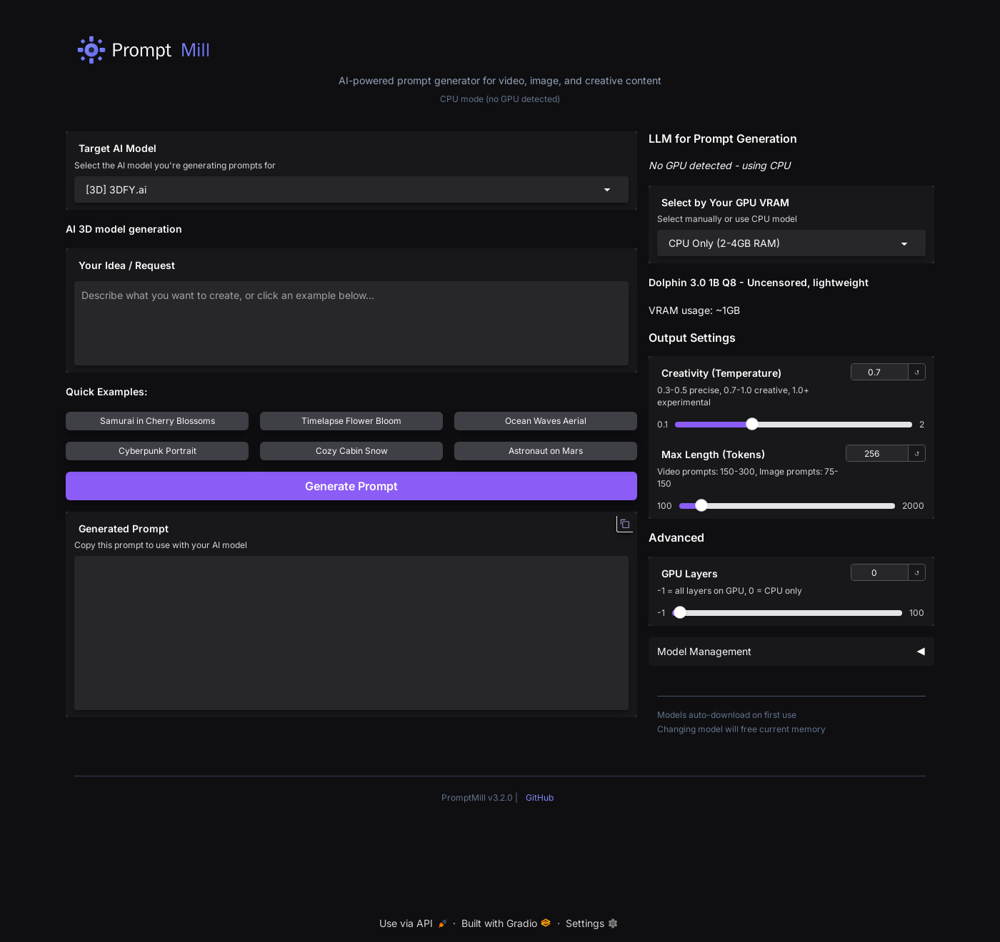
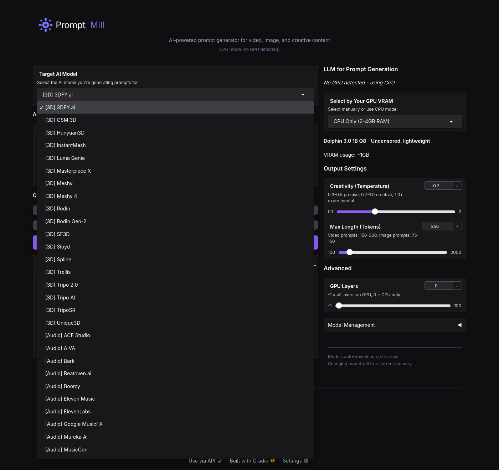

<div align="center">


<br/>

**AI-powered prompt generator for video, image, audio, 3D and creative content**

[](https://python.org)
[](https://gradio.app)
[](https://github.com/kekzl/PromptMill/pkgs/container/promptmill)
[](https://docs.astral.sh/ruff/)
[](LICENSE)
[](https://github.com/kekzl/PromptMill)

[Quick Start](#-quick-start) · [Features](#-features) · [Supported Targets](#-supported-targets) · [Models](#-llm-options) · [REST API](#-rest-api) · [Configuration](#%EF%B8%8F-configuration)

</div>

---

## Overview

PromptMill is a self-contained web UI that runs **entirely locally** - no API keys, no cloud dependencies. It uses selectable LLMs (scaled by your GPU VRAM) to generate optimized prompts for AI video, image, audio, 3D and writing tools.

<div align="center">
<table>
<tr>
<td align="center"><b>146</b><br><sub>Prompt Targets</sub></td>
<td align="center"><b>7</b><br><sub>LLM Tiers</sub></td>
<td align="center"><b>1B-8B</b><br><sub>Parameters</sub></td>
<td align="center"><b>100%</b><br><sub>Local</sub></td>
</tr>
</table>
</div>

---

## 🚀 Quick Start

One command, nothing to compile. The images are prebuilt on GHCR.

```bash
git clone https://github.com/kekzl/PromptMill.git
cd PromptMill
./start.sh
```

`start.sh` detects whether the NVIDIA container runtime is available, pulls the matching image, waits for the health check and prints the URL. Stop it again with `./start.sh stop`.

<details>
<summary>Without the script</summary>

```bash
docker compose --profile gpu up -d    # NVIDIA GPU
docker compose --profile cpu up -d    # CPU only
```

Or without cloning anything, straight from the published image:

```bash
docker run -d --name promptmill -p 7610:7610 \
  -v promptmill-models:/app/models \
  ghcr.io/kekzl/promptmill:cpu

# GPU (needs nvidia-container-toolkit)
docker run -d --name promptmill --gpus all -p 7610:7610 \
  -v promptmill-models:/app/models \
  ghcr.io/kekzl/promptmill:gpu
```

</details>

Open **http://localhost:7610** - API docs at **http://localhost:7610/docs**.

> The prompt-writing model auto-downloads on first use and persists in the `promptmill-models` volume.

### Available images

| Image | Base | Use |
|:------|:-----|:----|
| `ghcr.io/kekzl/promptmill:cpu` | `python:3.14-slim-trixie` | No GPU required |
| `ghcr.io/kekzl/promptmill:gpu` | `nvidia/cuda:13.3.1-ubuntu26.04` | NVIDIA GPU, CUDA offload |

Version-pinned tags follow releases: `ghcr.io/kekzl/promptmill:3.3.0-cpu`.

### Building from source

```bash
docker compose -f docker-compose.yml -f docker-compose.build.yml \
  --profile gpu up -d --build
```

The CPU image installs `llama-cpp-python` from the project's own wheel index and needs no
compiler. The GPU image compiles it against CUDA, which takes a while.

---

## ✨ Features

- **Smart GPU Detection** - Automatically selects the best model for your VRAM
- **7 LLM Tiers** - From 1B (CPU) to 8B parameters (24GB+ VRAM) using uncensored Dolphin models
- **146 Specialized Targets** - Video (36), Image (35), Audio (20), 3D (21), Creative (34)
- **Category Filter** - Narrow 146 targets down to one category, or type to search
- **Per-Category Examples** - The starter ideas match the selected target, not just video
- **Session History** - The last 20 generations, restorable with their inputs
- **REST API** - Generate prompts from scripts, streaming or buffered
- **Model Cleanup** - Delete downloaded models to free disk space
- **Zero Config** - Prebuilt images, one start script
- **Fully Offline** - No API keys or internet required after the first model download
- **Thread-Safe** - Concurrent request handling with proper locking

---

## 📸 Screenshots

<div align="center">

### Main Interface


*Clean dark UI with quick examples and customizable generation settings*

### AI Model Targets


*Support for Video, Image, Audio, 3D, and Creative AI tools*

</div>

---

## 🎯 Supported Targets

<table>
<tr>
<td width="50%">

### 🎬 Video (36)
Wan2.1, Wan2.2, Wan2.5, Hunyuan Video, Hunyuan Video 1.5, Runway Gen-3, Runway Gen-4.5, Kling AI, Kling 2.1, Kling 2.5, Kling Video O1, Pika Labs, Pika 2.1, Pika 2.2, Luma Dream Machine, Luma Ray2, Luma Ray3, Sora, Sora 2, Veo, Veo 3, Veo 3.1, Hailuo AI, Hailuo 02, Grok Imagine, Vidu Q1, Seedance, SkyReels V1, Mochi 1, CogVideoX, LTX Video, LTX-2, Open-Sora, MovieGen, Pyramid Flow, Allegro

### 🖼️ Image (35)
Stable Diffusion, SDXL, SD 3.5, Midjourney, Midjourney v7, FLUX, FLUX 2, FLUX 2 Max, FLUX Pro, FLUX Kontext, DALL-E 3, ComfyUI, Ideogram, Ideogram 3, Leonardo AI, Adobe Firefly, Adobe Firefly 3, Recraft, Recraft V3, Imagen 3, Imagen 4, GPT-4o Images, GPT Image 1.5, Reve Image, HiDream-I1, Qwen-Image, Qwen-Image Edit, Grok Image, Hunyuan Image 3.0, Seedream 4.5, Gemini 3 Pro Image, Playground v3, Krea AI, Luma Photon, Z-Image

</td>
<td width="50%">

### 🔊 Audio (20)
Suno AI, Suno v4.5, Suno v5, Udio, Udio 2.0, ElevenLabs, ElevenLabs SFX, Eleven Music, Mureka AI, SOUNDRAW, Beatoven.ai, Stable Audio 2.0, Stable Audio 2.5, MusicGen, Google MusicFX, Riffusion, Bark, ACE Studio, AIVA, Boomy

### 🧊 3D (21)
Meshy, Meshy 4, Meshy 5, Tripo AI, Tripo 2.0, Tripo 3.0, Rodin, Rodin Gen-2, Spline, Sloyd, 3DFY.ai, Luma Genie, Masterpiece X, Hunyuan3D, Hunyuan3D 2.1, Trellis, TripoSR, Unique3D, SF3D, InstantMesh, CSM 3D

### ✍️ Creative (34)
Story Writer, Code Generator, Technical Writer, Marketing Copy, SEO Content, Screenplay Writer, Social Media, Podcast Script, UX Writer, Press Release, Poetry, Data Analysis, Business Plan, Academic Writer, Tutorial Writer, Newsletter, Legal Documents, Grant Writing, API Documentation, Course Content, Pitch Deck, Meeting Notes, Changelog, Recipe Writer, Travel Guide, Workout Plan, Resume/CV, Cover Letter, Product Description, Email Template, Speech Writer, FAQ Writer, Bio Writer, Testimonial

</td>
</tr>
</table>

---

## 🧠 LLM Options

PromptMill automatically selects a tier based on detected VRAM. All tiers are **uncensored Dolphin 3.0** builds. The VRAM column is weights plus KV cache at the listed context length, not weights alone.

| VRAM | Model | Context | Needs | Quality |
|:-----|:------|:--------|:------|:--------|
| CPU | Dolphin 3.0 Llama 3.2 1B Q8 | 4K | ~1.5GB | ⭐ |
| 4GB | Dolphin 3.0 Llama 3.2 3B Q4_K_M | 4K | ~2.5GB | ⭐⭐ |
| 6GB | Dolphin 3.0 Llama 3.2 3B Q8 | 4K | ~4GB | ⭐⭐⭐ |
| 8GB | Dolphin 3.0 Llama 3.1 8B Q4_K_M | 8K | ~6GB | ⭐⭐⭐⭐ |
| 12GB | Dolphin 3.0 Llama 3.1 8B Q6_K_L | 8K | ~8GB | ⭐⭐⭐⭐ |
| 16GB | Dolphin 3.0 Llama 3.1 8B Q8 | 16K | ~10GB | ⭐⭐⭐⭐⭐ |
| 24GB+ | Dolphin 3.0 Llama 3.1 8B Q8 | 32K | ~13GB | ⭐⭐⭐⭐⭐ |

---

## 🔌 REST API

Everything the UI does is reachable over HTTP. Interactive docs: `http://localhost:7610/docs`.

| Method | Path | Purpose |
|:-------|:-----|:--------|
| `GET` | `/health` | Health and status for orchestration |
| `GET` | `/api/targets` | List targets, optional `?category=Video` |
| `GET` | `/api/models` | List LLM tiers and their download state |
| `POST` | `/api/generate` | Generate a prompt, returns JSON |
| `POST` | `/api/generate/stream` | Generate a prompt, streams plain text |

```bash
curl -s http://localhost:7610/api/generate \
  -H 'content-type: application/json' \
  -d '{"input": "a lone lighthouse in a storm at dusk", "target": "[Video] Sora 2"}'
```

```json
{
  "prompt": "Wide establishing shot of a lone lighthouse ...",
  "target": "[Video] Sora 2",
  "model": "24GB+ VRAM (RTX 3090, RTX 4090, RTX 5090)",
  "characters": 412,
  "words": 63
}
```

Optional fields: `model`, `temperature` (0.1-2.0), `max_tokens` (100-2000). Omitting `model` uses the VRAM-selected tier.

Health response:

```json
{
  "status": "healthy",
  "version": "3.3.0",
  "model_loaded": false,
  "model_path": null,
  "roles_count": 146,
  "disk_usage_bytes": 0
}
```

---

## ⚙️ Configuration

The app auto-configures based on your hardware:

- **GPU detected** → Uses all layers on GPU, selects model by VRAM
- **No GPU** → CPU mode with the lightweight 1B model

The UI overrides both: pick any tier, and set GPU layers manually (changing it reloads the model with the new split).

### Environment Variables

| Variable | Default | Description |
|:---------|:--------|:------------|
| `PROMPTMILL_PORT` | `7610` | Host port published by docker compose |
| `SERVER_HOST` | `127.0.0.1` (`0.0.0.0` in the images) | Server bind address |
| `SERVER_PORT` | `7610` | Port the app listens on |
| `MODELS_DIR` | `/app/models` | Directory for model storage |
| `LOG_LEVEL` | `INFO` | `DEBUG`, `INFO`, `WARNING`, `ERROR` |

Copy `.env.example` to `.env` to set them for docker compose.

> **Security Note**: Outside Docker the default `127.0.0.1` only allows local access. The container images bind `0.0.0.0` because a container port is only reachable through `-p` anyway. Put a reverse proxy in front for anything public.

---

## 📁 Project Structure

```
PromptMill/
├── src/promptmill/          # Application source (Hexagonal Architecture)
│   ├── __main__.py          # Entry point
│   ├── container.py         # Dependency injection container
│   ├── domain/              # Domain layer (entities, ports, exceptions)
│   │   ├── entities/        # Model, Role, GPUInfo
│   │   ├── value_objects/   # PromptGenerationRequest/Result
│   │   ├── ports/           # Abstract interfaces (LLM, Repository)
│   │   └── exceptions.py    # Domain exceptions
│   ├── application/         # Application layer (use cases, services)
│   │   ├── use_cases/       # GeneratePrompt, LoadModel, etc.
│   │   └── services/        # PromptService, ModelService, HealthService
│   ├── infrastructure/      # Infrastructure layer (adapters, config)
│   │   ├── adapters/        # LlamaCpp, HuggingFace, NvidiaSmi adapters
│   │   ├── config/          # Settings, ModelConfigs
│   │   └── persistence/     # RolesData (146 prompt templates)
│   └── presentation/        # Presentation layer
│       ├── gradio_app.py    # Gradio UI
│       ├── api.py           # REST API router
│       ├── examples.py      # Per-category starter examples
│       ├── history.py       # Per-session prompt history
│       └── theme.py         # Dark theme configuration
├── tests/                   # Unit & integration tests
├── start.sh                 # One-command launcher
├── docker-compose.yml       # Runs the prebuilt GHCR images
├── docker-compose.build.yml # Build overlay for contributors
├── Dockerfile.gpu           # CUDA build
├── Dockerfile.cpu           # CPU build
├── Dockerfile.test          # Lint + test image (no llama-cpp compile)
└── pyproject.toml           # Project config & dependencies
```

---

## 🛠️ Development

Everything runs in containers; no local Python toolchain needed.

```bash
# Lint, format check and the full test suite
docker compose -f docker-compose.yml -f docker-compose.build.yml \
  --profile test run --rm test

# Just the tests
docker compose -f docker-compose.yml -f docker-compose.build.yml \
  --profile test run --rm test pytest tests -q

# Lint and autofix
docker compose -f docker-compose.yml -f docker-compose.build.yml \
  --profile test run --rm test sh -c "ruff check --fix . && ruff format ."
```

<details>
<summary>Local toolchain instead (Python 3.13+ and <a href="https://docs.astral.sh/uv/">uv</a>)</summary>

```bash
uv sync --extra dev
uv run python -m promptmill
uv run ruff check --fix && uv run ruff format
uv run pytest tests -q
```

</details>

### Architecture

PromptMill uses **Hexagonal Architecture** (Ports and Adapters) with **Domain-Driven Design**:

- **Domain Layer**: Pure Python entities, value objects, and port interfaces. No external imports.
- **Application Layer**: Use cases and services orchestrating business logic
- **Infrastructure Layer**: Adapters implementing ports (LlamaCpp, HuggingFace, NvidiaSmi)
- **Presentation Layer**: Gradio UI and the REST API

---

## 🔧 Troubleshooting

### CUDA/GPU Errors
- Set GPU Layers to `0` in the UI for CPU-only mode
- Ensure NVIDIA drivers are installed: `nvidia-smi`
- For Docker, the nvidia-container-toolkit must be installed; `./start.sh` falls back to CPU when it is missing

### Model Download Issues
- Check internet connectivity
- Models live in the `promptmill-models` volume; inspect with `docker volume inspect promptmill_promptmill-models`
- Delete and re-download via "Model Management" in the UI

### Memory Issues
- Try a smaller model (lower VRAM tier)
- Close other GPU-intensive applications
- The model auto-unloads after 10 seconds of inactivity

### Port Already in Use
```bash
PROMPTMILL_PORT=8080 ./start.sh
```

---

## 🤝 Contributing

Contributions welcome! Feel free to:
- Report bugs or request features via [Issues](https://github.com/kekzl/PromptMill/issues)
- Submit pull requests

---

## 📄 License

MIT License - see [LICENSE](LICENSE) for details.

---

<div align="center">

**[⬆ Back to top](#)**

Made with ❤️ for the AI creative community

</div>
